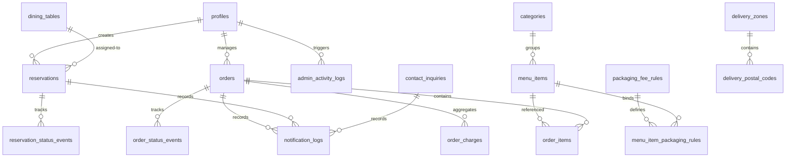

# Namaste Indian Restaurant - Enterprise-Grade Architecture Blueprint & 10-Phase Roadmap

This document outlines the system design, relational database schema, security model, and execution roadmap for **Namaste Indian Restaurant** in Warszawska 1/3, 06-400 Ciechanów, Poland.

> [!IMPORTANT]
> This project must not be built like a basic restaurant website or simple MVP. It must feel like a premium hospitality platform designed by a senior product team with deep experience in restaurant operations, luxury branding, UX, full-stack engineering, database security, GDPR, and production systems.

---

## 1. Product Requirements Document (PRD) & Design Core

### Core Parameters
*   **Establishment:** Namaste Indian Restaurant.
*   **Location:** Warszawska 1/3, 06-400 Ciechanów, Poland.
*   **Coordinates Verification:** Restaurant coordinates must be verified using geocoding before saving them. Do not rely on guessed coordinates. Once verified, store them in `system_settings`.
*   **Timezone:** `Europe/Warsaw` (Poland timezone).
*   **Phone:** 511984331.
*   **Locales:** Polish (PL) and English (EN) using `next-intl`.
*   **Brand Aesthetics:** Sleek luxury Navy backgrounds (`#0A1128`), brushed warm gold borders (`#D4AF37`), fine Indian mandala vector watermarks, elegant typography (serif headings like *Cinzel* / *Playfair Display* paired with clean geometric body text like *Outfit*), and high-resolution food photography grid.

### Strict Operation Rules
1.  **Reservations:** No automatic confirmation, rules, or table assignment. All public reservations enter as `pending`. Admins manually confirm, assign tables, input rejection/cancellation reasons, or flag no-shows.
2.  **Orders:** All delivery/takeaway checkouts enter as `pending`. Admins manually approve, reject, or assign drivers and estimated times.
3.  **Payment Scope:** Cash and Card on Delivery/Pickup only. Enums: `cash_on_delivery`, `cash_on_pickup`, `card_on_delivery`, `card_on_pickup`. Online payments are out of scope.
4.  **Recalculation:** Client-provided totals are treated as unverified. The server calculates subtotals, distance fees, packaging charges, and discounts using database pricing and configurations.

---

## 2. Complete Relational Database Schema

All tables reside on a clean, isolated Supabase project.



### Type Definitions
```sql
CREATE TYPE user_role AS ENUM ('owner', 'manager', 'kitchen', 'staff');
CREATE TYPE reservation_status AS ENUM ('pending', 'confirmed', 'rejected', 'cancelled', 'completed', 'no_show');
CREATE TYPE reservation_source AS ENUM ('website', 'phone', 'walk_in', 'admin');
CREATE TYPE service_hours_type AS ENUM ('dine_in', 'reservations', 'delivery', 'takeaway');
CREATE TYPE affected_service_type AS ENUM ('all', 'dine_in', 'reservations', 'delivery', 'takeaway');
CREATE TYPE inquiry_status AS ENUM ('new', 'read', 'replied', 'archived');
CREATE TYPE order_type AS ENUM ('delivery', 'takeaway');
CREATE TYPE order_status AS ENUM ('pending', 'approved', 'preparing', 'out_for_delivery', 'delivered', 'ready_for_pickup', 'picked_up', 'completed', 'rejected', 'cancelled');
CREATE TYPE payment_status AS ENUM ('pending', 'paid', 'failed');
CREATE TYPE payment_method AS ENUM ('cash_on_delivery', 'cash_on_pickup', 'card_on_delivery', 'card_on_pickup');
CREATE TYPE packaging_fee_type AS ENUM ('food_container', 'beverage_cup', 'bag', 'custom');
CREATE TYPE charge_type AS ENUM ('delivery_fee', 'packaging_fee', 'service_fee', 'discount', 'manual_adjustment');
CREATE TYPE notification_channel AS ENUM ('brevo', 'telegram');
CREATE TYPE notification_status AS ENUM ('pending', 'sent', 'failed', 'retrying');
CREATE TYPE geocoding_status_type AS ENUM ('pending', 'success', 'failed', 'manually_corrected');
CREATE TYPE rule_action_type AS ENUM ('allow', 'contact_restaurant', 'block');
```

### Automatic `updated_at` Trigger Generator
```sql
CREATE OR REPLACE FUNCTION trigger_set_timestamp()
RETURNS TRIGGER AS $$
BEGIN
  NEW.updated_at = NOW();
  RETURN NEW;
END;
$$ LANGUAGE plpgsql;
```

### Tables Setup

#### 1. Table: `profiles`
```sql
CREATE TABLE profiles (
    id uuid REFERENCES auth.users ON DELETE CASCADE PRIMARY KEY,
    email text UNIQUE NOT NULL,
    role user_role NOT NULL DEFAULT 'staff',
    full_name text NOT NULL,
    phone text,
    is_active boolean NOT NULL DEFAULT true,
    created_at timestamptz DEFAULT now() NOT NULL,
    updated_at timestamptz DEFAULT now() NOT NULL
);

CREATE TRIGGER set_timestamp_profiles
BEFORE UPDATE ON profiles
FOR EACH ROW EXECUTE PROCEDURE trigger_set_timestamp();
```

#### 2. Table: `dining_tables`
```sql
CREATE TABLE dining_tables (
    id uuid DEFAULT gen_random_uuid() PRIMARY KEY,
    table_number integer UNIQUE NOT NULL,
    capacity integer NOT NULL CHECK (capacity > 0),
    section text NOT NULL,
    is_active boolean NOT NULL DEFAULT true,
    notes text,
    created_at timestamptz DEFAULT now() NOT NULL,
    updated_at timestamptz DEFAULT now() NOT NULL
);

CREATE TRIGGER set_timestamp_dining_tables
BEFORE UPDATE ON dining_tables
FOR EACH ROW EXECUTE PROCEDURE trigger_set_timestamp();
```

#### 3. Table: `reservations`
```sql
CREATE TABLE reservations (
    id uuid DEFAULT gen_random_uuid() PRIMARY KEY,
    customer_id uuid REFERENCES profiles(id) ON DELETE SET NULL,
    table_id uuid REFERENCES dining_tables(id) ON DELETE SET NULL,
    customer_name text NOT NULL,
    customer_email text, -- NULL allowed for manual admin bookings, required for website
    customer_phone text NOT NULL,
    reservation_start_at timestamptz NOT NULL,
    reservation_end_at timestamptz NOT NULL,
    timezone text NOT NULL DEFAULT 'Europe/Warsaw',
    guests_count integer NOT NULL CHECK (guests_count > 0),
    status reservation_status NOT NULL DEFAULT 'pending',
    source reservation_source NOT NULL DEFAULT 'website',
    rejection_reason text,
    cancellation_reason text,
    admin_notes text,
    customer_notes text,
    token uuid DEFAULT gen_random_uuid() UNIQUE NOT NULL,
    idempotency_key text UNIQUE,
    created_by_admin_id uuid REFERENCES profiles(id) ON DELETE SET NULL,
    consent_accepted_at timestamptz,
    privacy_policy_version text,
    terms_version text,
    created_at timestamptz DEFAULT now() NOT NULL,
    updated_at timestamptz DEFAULT now() NOT NULL,
    CONSTRAINT chk_reservation_times CHECK (reservation_start_at < reservation_end_at)
);

CREATE TRIGGER set_timestamp_reservations
BEFORE UPDATE ON reservations
FOR EACH ROW EXECUTE PROCEDURE trigger_set_timestamp();
```

#### 4. Table: `reservation_status_events`
```sql
CREATE TABLE reservation_status_events (
    id uuid DEFAULT gen_random_uuid() PRIMARY KEY,
    reservation_id uuid REFERENCES reservations(id) ON DELETE CASCADE NOT NULL,
    old_status reservation_status,
    new_status reservation_status NOT NULL,
    changed_by uuid REFERENCES profiles(id) ON DELETE SET NULL,
    reason text,
    metadata jsonb DEFAULT '{}'::jsonb NOT NULL,
    created_at timestamptz DEFAULT now() NOT NULL
);
```

#### 5. Table: `categories`
```sql
CREATE TABLE categories (
    id uuid DEFAULT gen_random_uuid() PRIMARY KEY,
    name_pl text NOT NULL,
    name_en text NOT NULL,
    slug text UNIQUE NOT NULL,
    display_order integer NOT NULL DEFAULT 0,
    is_active boolean NOT NULL DEFAULT true,
    is_deleted boolean NOT NULL DEFAULT false,
    deleted_at timestamptz,
    deleted_by uuid REFERENCES profiles(id),
    created_at timestamptz DEFAULT now() NOT NULL,
    updated_at timestamptz DEFAULT now() NOT NULL
);

CREATE TRIGGER set_timestamp_categories
BEFORE UPDATE ON categories
FOR EACH ROW EXECUTE PROCEDURE trigger_set_timestamp();
```

#### 6. Table: `menu_items`
```sql
CREATE TABLE menu_items (
    id uuid DEFAULT gen_random_uuid() PRIMARY KEY,
    category_id uuid REFERENCES categories(id) ON DELETE RESTRICT NOT NULL,
    name_pl text NOT NULL,
    name_en text NOT NULL,
    description_pl text,
    description_en text,
    price numeric(10,2) NOT NULL CHECK (price >= 0),
    image_url text,
    is_available boolean NOT NULL DEFAULT true,
    is_active boolean NOT NULL DEFAULT true,
    is_deleted boolean NOT NULL DEFAULT false,
    deleted_at timestamptz,
    deleted_by uuid REFERENCES profiles(id),
    spiciness integer NOT NULL DEFAULT 0 CHECK (spiciness BETWEEN 0 AND 3),
    allergens text[] DEFAULT '{}'::text[] NOT NULL,
    is_vegetarian boolean NOT NULL DEFAULT false,
    is_vegan boolean NOT NULL DEFAULT false,
    is_gluten_free boolean NOT NULL DEFAULT false,
    is_chef_special boolean NOT NULL DEFAULT false,
    is_popular boolean NOT NULL DEFAULT false,
    is_new boolean NOT NULL DEFAULT false,
    preparation_time integer NOT NULL DEFAULT 15,
    upsell_suggestions uuid[] DEFAULT '{}'::uuid[] NOT NULL,
    display_order integer NOT NULL DEFAULT 0,
    created_at timestamptz DEFAULT now() NOT NULL,
    updated_at timestamptz DEFAULT now() NOT NULL
);

CREATE TRIGGER set_timestamp_menu_items
BEFORE UPDATE ON menu_items
FOR EACH ROW EXECUTE PROCEDURE trigger_set_timestamp();
```

#### 7. Table: `service_hours`
Supports multiple open/close periods (split shifts) per service per day. Overlap checked server-side and trigger-validated.
```sql
CREATE TABLE service_hours (
    id uuid DEFAULT gen_random_uuid() PRIMARY KEY,
    service_type service_hours_type NOT NULL,
    day_of_week integer NOT NULL CHECK (day_of_week BETWEEN 0 AND 6),
    slot_number integer NOT NULL DEFAULT 1 CHECK (slot_number > 0),
    open_time time NOT NULL,
    close_time time NOT NULL,
    is_closed boolean NOT NULL DEFAULT false,
    min_lead_time_minutes integer NOT NULL DEFAULT 30,
    max_preorder_days integer NOT NULL DEFAULT 7,
    last_order_time time,
    display_order integer NOT NULL DEFAULT 0,
    created_at timestamptz DEFAULT now() NOT NULL,
    updated_at timestamptz DEFAULT now() NOT NULL,
    updated_by uuid REFERENCES profiles(id),
    CONSTRAINT chk_service_times CHECK (open_time < close_time),
    CONSTRAINT uq_service_slot UNIQUE (service_type, day_of_week, slot_number)
);

CREATE TRIGGER set_timestamp_service_hours
BEFORE UPDATE ON service_hours
FOR EACH ROW EXECUTE PROCEDURE trigger_set_timestamp();
```

#### 8. Table: `holiday_closures`
```sql
CREATE TABLE holiday_closures (
    id uuid DEFAULT gen_random_uuid() PRIMARY KEY,
    date date NOT NULL,
    title_pl text NOT NULL,
    title_en text NOT NULL,
    affected_service affected_service_type NOT NULL DEFAULT 'all',
    is_closed boolean NOT NULL DEFAULT true,
    custom_open_time time,
    custom_close_time time,
    message_pl text,
    message_en text,
    created_at timestamptz DEFAULT now() NOT NULL,
    updated_at timestamptz DEFAULT now() NOT NULL,
    updated_by uuid REFERENCES profiles(id),
    CONSTRAINT uq_holiday_date_service UNIQUE (date, affected_service)
);

CREATE TRIGGER set_timestamp_holiday_closures
BEFORE UPDATE ON holiday_closures
FOR EACH ROW EXECUTE PROCEDURE trigger_set_timestamp();
```

#### 9. Table: `operational_status`
```sql
CREATE TABLE operational_status (
    id uuid DEFAULT gen_random_uuid() PRIMARY KEY,
    delivery_enabled boolean NOT NULL DEFAULT true,
    takeaway_enabled boolean NOT NULL DEFAULT true,
    reservations_enabled boolean NOT NULL DEFAULT true,
    dine_in_status text NOT NULL DEFAULT 'open',
    kitchen_busy_mode boolean NOT NULL DEFAULT false,
    temporary_message_pl text,
    temporary_message_en text,
    estimated_delay_minutes integer NOT NULL DEFAULT 0,
    updated_at timestamptz DEFAULT now() NOT NULL,
    updated_by uuid REFERENCES profiles(id)
);

CREATE TRIGGER set_timestamp_operational_status
BEFORE UPDATE ON operational_status
FOR EACH ROW EXECUTE PROCEDURE trigger_set_timestamp();
```

#### 10. Table: `system_settings`
```sql
CREATE TABLE system_settings (
    key text PRIMARY KEY,
    value jsonb NOT NULL,
    description text,
    updated_by uuid REFERENCES profiles(id),
    updated_at timestamptz DEFAULT now() NOT NULL
);

CREATE TRIGGER set_timestamp_system_settings
BEFORE UPDATE ON system_settings
FOR EACH ROW EXECUTE PROCEDURE trigger_set_timestamp();
```

#### 11. Table: `contact_inquiries`
```sql
CREATE TABLE contact_inquiries (
    id uuid DEFAULT gen_random_uuid() PRIMARY KEY,
    name text NOT NULL,
    email text NOT NULL,
    phone text,
    subject text NOT NULL,
    message text NOT NULL,
    status inquiry_status NOT NULL DEFAULT 'new',
    source_language text NOT NULL DEFAULT 'pl',
    ip_hash text,
    user_agent text,
    consent_accepted_at timestamptz NOT NULL,
    privacy_policy_version text NOT NULL,
    created_at timestamptz DEFAULT now() NOT NULL,
    updated_at timestamptz DEFAULT now() NOT NULL
);

CREATE TRIGGER set_timestamp_contact_inquiries
BEFORE UPDATE ON contact_inquiries
FOR EACH ROW EXECUTE PROCEDURE trigger_set_timestamp();
```

#### 12. Table: `site_content`
```sql
CREATE TABLE site_content (
    key text PRIMARY KEY,
    value_pl jsonb NOT NULL,
    value_en jsonb NOT NULL,
    updated_by uuid REFERENCES profiles(id),
    updated_at timestamptz DEFAULT now() NOT NULL
);

CREATE TRIGGER set_timestamp_site_content
BEFORE UPDATE ON site_content
FOR EACH ROW EXECUTE PROCEDURE trigger_set_timestamp();
```

#### 13. Table: `media_assets`
```sql
CREATE TABLE media_assets (
    id uuid DEFAULT gen_random_uuid() PRIMARY KEY,
    bucket text NOT NULL CHECK (bucket IN ('menu-images', 'site-images', 'gallery-images')),
    file_path text NOT NULL,
    alt_text_pl text,
    alt_text_en text,
    file_type text NOT NULL,
    file_size integer NOT NULL,
    is_public boolean NOT NULL DEFAULT true,
    is_approved boolean NOT NULL DEFAULT true,
    uploaded_by uuid REFERENCES profiles(id),
    created_at timestamptz DEFAULT now() NOT NULL
);
```

#### 14. Table: `delivery_zones`
```sql
CREATE TABLE delivery_zones (
    id uuid DEFAULT gen_random_uuid() PRIMARY KEY,
    name text UNIQUE NOT NULL,
    is_active boolean NOT NULL DEFAULT true,
    radius_km numeric(5,2),
    min_order_amount numeric(10,2) NOT NULL DEFAULT 40.00,
    delivery_fee numeric(10,2) NOT NULL DEFAULT 0.00,
    estimated_delivery_minutes integer NOT NULL DEFAULT 45,
    created_at timestamptz DEFAULT now() NOT NULL,
    updated_at timestamptz DEFAULT now() NOT NULL
);

CREATE TRIGGER set_timestamp_delivery_zones
BEFORE UPDATE ON delivery_zones
FOR EACH ROW EXECUTE PROCEDURE trigger_set_timestamp();
```

#### 15. Table: `delivery_postal_codes`
```sql
CREATE TABLE delivery_postal_codes (
    id uuid DEFAULT gen_random_uuid() PRIMARY KEY,
    postal_code text UNIQUE NOT NULL,
    zone_id uuid REFERENCES delivery_zones(id) ON DELETE CASCADE NOT NULL,
    is_active boolean NOT NULL DEFAULT true,
    delivery_fee_override numeric(10,2),
    min_order_override numeric(10,2)
);
```

#### 16. Table: `delivery_fee_rules`
Distance-based delivery boundaries.
```sql
CREATE TABLE delivery_fee_rules (
    id uuid DEFAULT gen_random_uuid() PRIMARY KEY,
    name text NOT NULL,
    min_distance_km numeric(5,2) NOT NULL,
    max_distance_km numeric(5,2),
    fee_amount numeric(10,2) NOT NULL CHECK (fee_amount >= 0),
    rule_action rule_action_type NOT NULL DEFAULT 'allow',
    message_pl text,
    message_en text,
    is_active boolean NOT NULL DEFAULT true,
    display_order integer NOT NULL DEFAULT 0,
    created_at timestamptz DEFAULT now() NOT NULL,
    updated_at timestamptz DEFAULT now() NOT NULL,
    updated_by uuid REFERENCES profiles(id),
    CONSTRAINT chk_distance_range CHECK (max_distance_km IS NULL OR min_distance_km < max_distance_km)
);

CREATE TRIGGER set_timestamp_delivery_fee_rules
BEFORE UPDATE ON delivery_fee_rules
FOR EACH ROW EXECUTE PROCEDURE trigger_set_timestamp();
```

#### 17. Table: `packaging_fee_rules`
```sql
CREATE TABLE packaging_fee_rules (
    id uuid DEFAULT gen_random_uuid() PRIMARY KEY,
    name_pl text NOT NULL,
    name_en text NOT NULL,
    fee_type packaging_fee_type NOT NULL,
    amount numeric(10,2) NOT NULL CHECK (amount >= 0),
    applies_to_delivery boolean NOT NULL DEFAULT true,
    applies_to_takeaway boolean NOT NULL DEFAULT true,
    applies_to_dine_in boolean NOT NULL DEFAULT false,
    is_active boolean NOT NULL DEFAULT true,
    tax_behavior text NOT NULL DEFAULT 'inclusive',
    effective_from timestamptz NOT NULL DEFAULT now(),
    effective_to timestamptz,
    created_at timestamptz DEFAULT now() NOT NULL,
    updated_at timestamptz DEFAULT now() NOT NULL,
    updated_by uuid REFERENCES profiles(id)
);

CREATE TRIGGER set_timestamp_packaging_fee_rules
BEFORE UPDATE ON packaging_fee_rules
FOR EACH ROW EXECUTE PROCEDURE trigger_set_timestamp();
```

#### 18. Table: `menu_item_packaging_rules`
```sql
CREATE TABLE menu_item_packaging_rules (
    id uuid DEFAULT gen_random_uuid() PRIMARY KEY,
    menu_item_id uuid REFERENCES menu_items(id) ON DELETE CASCADE NOT NULL,
    packaging_fee_rule_id uuid REFERENCES packaging_fee_rules(id) ON DELETE CASCADE NOT NULL,
    default_quantity integer NOT NULL DEFAULT 1 CHECK (default_quantity >= 0),
    is_required boolean NOT NULL DEFAULT true,
    created_at timestamptz DEFAULT now() NOT NULL,
    updated_at timestamptz DEFAULT now() NOT NULL,
    UNIQUE (menu_item_id, packaging_fee_rule_id)
);

CREATE TRIGGER set_timestamp_menu_item_packaging_rules
BEFORE UPDATE ON menu_item_packaging_rules
FOR EACH ROW EXECUTE PROCEDURE trigger_set_timestamp();
```

#### 19. Table: `orders`
```sql
CREATE TABLE orders (
    id uuid DEFAULT gen_random_uuid() PRIMARY KEY,
    customer_id uuid REFERENCES profiles(id) ON DELETE SET NULL,
    customer_name text NOT NULL,
    customer_email text NOT NULL,
    customer_phone text NOT NULL,
    order_type order_type NOT NULL,
    status order_status NOT NULL DEFAULT 'pending',
    delivery_address text,
    delivery_postal_code text,
    delivery_city text,
    delivery_latitude numeric(9,6),
    delivery_longitude numeric(9,6),
    route_distance_km numeric(6,2),
    route_duration_car_minutes integer,
    route_duration_walk_minutes integer,
    route_provider text,
    geocoding_status geocoding_status_type NOT NULL DEFAULT 'pending',
    geocoding_error text,
    address_verified_at timestamptz,
    delivery_fee numeric(10,2) NOT NULL DEFAULT 0.00 CHECK (delivery_fee >= 0),
    items_subtotal numeric(10,2) NOT NULL CHECK (items_subtotal >= 0),
    packaging_total numeric(10,2) NOT NULL DEFAULT 0.00 CHECK (packaging_total >= 0),
    other_charges_total numeric(10,2) NOT NULL DEFAULT 0.00 CHECK (other_charges_total >= 0),
    discount_total numeric(10,2) NOT NULL DEFAULT 0.00 CHECK (discount_total >= 0),
    total_amount numeric(10,2) NOT NULL CHECK (total_amount >= 0),
    payment_status payment_status NOT NULL DEFAULT 'pending',
    payment_method payment_method NOT NULL,
    token uuid DEFAULT gen_random_uuid() UNIQUE NOT NULL,
    idempotency_key text UNIQUE,
    customer_language text NOT NULL DEFAULT 'pl',
    rejection_reason text,
    cancellation_reason text,
    admin_notes text,
    customer_notes text,
    approved_at timestamptz,
    preparing_at timestamptz,
    ready_at timestamptz,
    dispatched_at timestamptz,
    completed_at timestamptz,
    created_by_admin_id uuid REFERENCES profiles(id) ON DELETE SET NULL,
    created_at timestamptz DEFAULT now() NOT NULL,
    updated_at timestamptz DEFAULT now() NOT NULL
);

CREATE TRIGGER set_timestamp_orders
BEFORE UPDATE ON orders
FOR EACH ROW EXECUTE PROCEDURE trigger_set_timestamp();
```

#### 20. Table: `order_status_events`
```sql
CREATE TABLE order_status_events (
    id uuid DEFAULT gen_random_uuid() PRIMARY KEY,
    order_id uuid REFERENCES orders(id) ON DELETE CASCADE NOT NULL,
    old_status order_status,
    new_status order_status NOT NULL,
    changed_by uuid REFERENCES profiles(id) ON DELETE SET NULL,
    reason text,
    metadata jsonb DEFAULT '{}'::jsonb NOT NULL,
    created_at timestamptz DEFAULT now() NOT NULL
);
```

#### 21. Table: `order_items`
```sql
CREATE TABLE order_items (
    id uuid DEFAULT gen_random_uuid() PRIMARY KEY,
    order_id uuid REFERENCES orders(id) ON DELETE CASCADE NOT NULL,
    menu_item_id uuid REFERENCES menu_items(id) ON DELETE SET NULL,
    item_name_pl text NOT NULL,
    item_name_en text NOT NULL,
    unit_price numeric(10,2) NOT NULL CHECK (unit_price >= 0),
    quantity integer NOT NULL CHECK (quantity > 0),
    line_total numeric(10,2) NOT NULL CHECK (line_total >= 0),
    customer_notes text,
    kitchen_notes text,
    allergens_snapshot text[] DEFAULT '{}'::text[] NOT NULL,
    spice_level_snapshot integer NOT NULL DEFAULT 0
);
```

#### 22. Table: `order_charges`
```sql
CREATE TABLE order_charges (
    id uuid DEFAULT gen_random_uuid() PRIMARY KEY,
    order_id uuid REFERENCES orders(id) ON DELETE CASCADE NOT NULL,
    charge_type charge_type NOT NULL,
    label_pl text NOT NULL,
    label_en text NOT NULL,
    amount numeric(10,2) NOT NULL,
    quantity integer NOT NULL DEFAULT 1,
    total_amount numeric(10,2) NOT NULL,
    tax_rate numeric(4,2),
    metadata jsonb,
    created_at timestamptz DEFAULT now() NOT NULL
);
```

#### 23. Table: `notification_logs`
```sql
CREATE TABLE notification_logs (
    id uuid DEFAULT gen_random_uuid() PRIMARY KEY,
    channel notification_channel NOT NULL,
    type text NOT NULL,
    status notification_status NOT NULL DEFAULT 'pending',
    retry_count integer NOT NULL DEFAULT 0,
    max_retries integer NOT NULL DEFAULT 3,
    error_message text,
    payload jsonb NOT NULL,
    related_order_id uuid REFERENCES orders(id) ON DELETE SET NULL,
    related_reservation_id uuid REFERENCES reservations(id) ON DELETE SET NULL,
    related_contact_inquiry_id uuid REFERENCES contact_inquiries(id) ON DELETE SET NULL,
    sent_at timestamptz,
    created_at timestamptz DEFAULT now() NOT NULL
);
```

#### 24. Table: `admin_activity_logs`
```sql
CREATE TABLE admin_activity_logs (
    id uuid DEFAULT gen_random_uuid() PRIMARY KEY,
    admin_id uuid REFERENCES profiles(id) ON DELETE SET NULL,
    action text NOT NULL,
    details jsonb,
    created_at timestamptz DEFAULT now() NOT NULL
);
```

---

## 3. Database Indexes

These indexes must be created via migrations and verified for query execution plans during testing in Phase 10:

```sql
CREATE INDEX idx_reservations_status_start ON reservations(status, reservation_start_at);
CREATE INDEX idx_reservations_overlap ON reservations(table_id, reservation_start_at, reservation_end_at) WHERE table_id IS NOT NULL;
CREATE INDEX idx_reservations_token ON reservations(token);
CREATE INDEX idx_reservations_src_status ON reservations(source, status);
CREATE INDEX idx_reservations_created ON reservations(created_at DESC);
CREATE INDEX idx_orders_lookup ON orders(status, order_type, created_at DESC);
CREATE INDEX idx_orders_token ON orders(token);
CREATE INDEX idx_orders_phone ON orders(customer_phone);
CREATE INDEX idx_orders_postal ON orders(delivery_postal_code);
CREATE INDEX idx_order_items_id ON order_items(order_id);
CREATE INDEX idx_order_charges_id ON order_charges(order_id);
CREATE INDEX idx_menu_items_cms ON menu_items(category_id, is_active, is_deleted, display_order);
CREATE INDEX idx_categories_cms ON categories(is_active, is_deleted, display_order);
CREATE INDEX idx_contact_inquiries_lookup ON contact_inquiries(status, created_at DESC);
CREATE INDEX idx_notification_logs_retry ON notification_logs(status, channel, created_at DESC);
CREATE INDEX idx_delivery_fee_rules_active ON delivery_fee_rules(is_active, display_order);
CREATE INDEX idx_service_hours_lookup ON service_hours(service_type, day_of_week);
CREATE INDEX idx_holiday_closures_lookup ON holiday_closures(date, affected_service);
CREATE INDEX idx_admin_activity_logs_lookup ON admin_activity_logs(admin_id, created_at DESC);
CREATE INDEX idx_res_status_events ON reservation_status_events(reservation_id, created_at DESC);
CREATE INDEX idx_order_status_events ON order_status_events(order_id, created_at DESC);
CREATE INDEX idx_media_assets_approved_public ON media_assets(is_approved, is_public);
```

---

## 4. Row Level Security (RLS) Policy Matrix

RLS is enabled on all tables. Public access is strictly isolated using secure API routes, server actions, or security-restricted RPCs.

| Table Name | SELECT | INSERT | UPDATE | DELETE | Authorized Roles |
| :--- | :--- | :--- | :--- | :--- | :--- |
| `profiles` | Own Profile, or Admin | None (Trigger-only) | Own Profile, or Owner | Owner | `owner` (Full), `manager` / `staff` / `kitchen` (Own only) |
| `dining_tables` | Admin, Staff, Kitchen | Admin, Manager | Admin, Manager | Admin, Manager | `owner`, `manager` (Write), `staff` / `kitchen` (Read) |
| `reservations` | Admin, Staff, or RPC token | Server Actions only | Admin, Staff, or RPC cancel | None | `owner`, `manager`, `staff` (Select/Update), `public` (Via secure API/RPC only) |
| `reservation_status_events` | Admin, Staff, or RPC token | Server Actions only | None | None | `owner`, `manager`, `staff` (Select), `public` (Via RPC timeline query only) |
| `categories` | Public (active/non-deleted only) | Admin, Manager | Admin, Manager | None (Soft-delete only) | `owner`, `manager` (Write), `public` (Read active) |
| `menu_items` | Public (active/non-deleted only) | Admin, Manager | Admin, Manager | None (Soft-delete only) | `owner`, `manager` (Write), `public` (Read active) |
| `service_hours` | Public (Read) | Admin, Manager | Admin, Manager | Admin, Manager | `owner`, `manager` (Write), `public` (Read) |
| `holiday_closures` | Public (Read) | Admin, Manager | Admin, Manager | Admin, Manager | `owner`, `manager` (Write), `public` (Read) |
| `operational_status` | Public (Read) | Admin, Manager | Admin, Manager | None | `owner`, `manager` (Write), `public` (Read) |
| `system_settings` | Denied | Admin (Owner) | Admin, Manager | None | `owner` (Full), `manager` (Write), `public` (No direct read. Access restricted to RPC) |
| `contact_inquiries` | Admin, Manager | Server Actions only | Admin, Manager | None | `owner`, `manager` (Read/Update), `public` (Insert via API only) |
| `site_content` | Public (Read) | Admin, Manager | Admin, Manager | None | `owner`, `manager` (Write), `public` (Read) |
| `media_assets` | Public (approved/public only) | Admin, Manager | Admin, Manager | Admin, Manager | `owner`, `manager` (Write), `public` (Read if is_approved and is_public) |
| `delivery_zones` | Public (Read) | Admin, Manager | Admin, Manager | Admin, Manager | `owner`, `manager` (Write), `public` (Read) |
| `delivery_postal_codes` | Public (Read) | Admin, Manager | Admin, Manager | Admin, Manager | `owner`, `manager` (Write), `public` (Read) |
| `delivery_fee_rules` | Public (Read) | Admin, Manager | Admin, Manager | Admin, Manager | `owner`, `manager` (Write), `public` (Read) |
| `packaging_fee_rules` | Public (Read) | Admin, Manager | Admin, Manager | Admin, Manager | `owner`, `manager` (Write), `public` (Read) |
| `menu_item_packaging_rules` | Public (Read) | Admin, Manager | Admin, Manager | Admin, Manager | `owner`, `manager` (Write), `public` (Read) |
| `orders` | Admin, Kitchen, or RPC token | Server Actions only | Admin, Kitchen status override | None | `owner`, `manager`, `staff` (Select/Update), `kitchen` (KDS status only), `public` (Via RPC) |
| `order_items` | Admin, Kitchen, or RPC token | Server Actions only | None | None | `owner`, `manager`, `staff` (Select), `kitchen` (KDS only), `public` (Via RPC) |
| `order_charges` | Admin, Kitchen, or RPC token | Server Actions only | None | None | `owner`, `manager`, `staff` (Select), `kitchen` (KDS only), `public` (Via RPC) |
| `order_status_events` | Admin, Kitchen, or RPC token | Server Actions only | None | None | `owner`, `manager`, `staff` (Select), `kitchen` (KDS only), `public` (Via RPC timeline query) |
| `notification_logs` | Owner, Manager | Server Actions only | Owner, Manager retry trigger | None | `owner`, `manager` (Select/Update) |
| `admin_activity_logs` | Owner | Trigger-only | None | None | `owner` (Select only) |

---

## 5. Security-Restricted Tracking & View Functions (`SECURITY DEFINER`)

These procedures execute with owner privilege, but return strictly sanitized, public-safe fields to prevent data leaks.

```sql
-- Secure RPC to expose only safe settings. Full table access is denied to public.
CREATE OR REPLACE FUNCTION get_public_system_settings()
RETURNS TABLE (
    key text,
    value jsonb
) SECURITY DEFINER SET search_path = public AS $$
BEGIN
    RETURN QUERY
    SELECT s.key, s.value
    FROM system_settings s
    WHERE s.key IN ('restaurant_address', 'restaurant_phone', 'opening_status', 'public_messages', 'public_service_hours');
END;
$$ LANGUAGE plpgsql;
```

```sql
CREATE OR REPLACE FUNCTION get_public_reservation_status_by_token(res_id uuid, sec_token uuid)
RETURNS TABLE (
    reservation_start_at timestamptz,
    reservation_end_at timestamptz,
    timezone text,
    guests_count integer,
    status reservation_status,
    rejection_reason text,
    cancellation_reason text,
    customer_notes text,
    timeline jsonb
) SECURITY DEFINER SET search_path = public AS $$
BEGIN
    RETURN QUERY 
    SELECT r.reservation_start_at, r.reservation_end_at, r.timezone, 
           r.guests_count, r.status, r.rejection_reason, r.cancellation_reason, 
           r.customer_notes,
           (
             SELECT json_agg(json_build_object(
               'status', e.new_status,
               'created_at', e.created_at
             ) ORDER BY e.created_at ASC)
             FROM reservation_status_events e
             WHERE e.reservation_id = r.id
           ) AS timeline
    FROM reservations r
    WHERE r.id = res_id AND r.token = sec_token;
END;
$$ LANGUAGE plpgsql;
```

```sql
-- Return partially masked/public-safe address formatting to protect customer privacy
CREATE OR REPLACE FUNCTION get_public_order_details_by_token(ord_id uuid, sec_token uuid)
RETURNS TABLE (
    order_type order_type,
    status order_status,
    delivery_address_public text,
    delivery_fee numeric(10,2),
    items_subtotal numeric(10,2),
    packaging_total numeric(10,2),
    other_charges_total numeric(10,2),
    discount_total numeric(10,2),
    total_amount numeric(10,2),
    payment_method payment_method,
    estimated_time timestamptz,
    rejection_reason text,
    cancellation_reason text,
    customer_notes text,
    created_at timestamptz,
    items jsonb,
    charges jsonb,
    timeline jsonb
) SECURITY DEFINER SET search_path = public AS $$
BEGIN
    RETURN QUERY
    SELECT o.order_type, o.status, 
           -- Mask details (e.g. "Warszawska 12/4, Ciechanów" -> "Warszawska **, Ciechanów")
           regexp_replace(o.delivery_address, '\s\d+.*?,', ' **,', 'g') AS delivery_address_public,
           o.delivery_fee, o.items_subtotal, o.packaging_total, o.other_charges_total, o.discount_total, 
           o.total_amount, o.payment_method, o.ready_at AS estimated_time,
           o.rejection_reason, o.cancellation_reason, o.customer_notes, o.created_at,
           (
             SELECT json_agg(json_build_object(
               'name_pl', i.item_name_pl,
               'name_en', i.item_name_en,
               'unit_price', i.unit_price,
               'quantity', i.quantity,
               'line_total', i.line_total,
               'customer_notes', i.customer_notes
             ))
             FROM order_items i
             WHERE i.order_id = o.id
           ) AS items,
           (
             SELECT json_agg(json_build_object(
               'type', c.charge_type,
               'label_pl', c.label_pl,
               'label_en', c.label_en,
               'total_amount', c.total_amount
             ))
             FROM order_charges c
             WHERE c.order_id = o.id
           ) AS charges,
           (
             SELECT json_agg(json_build_object(
               'status', e.new_status,
               'created_at', e.created_at
             ) ORDER BY e.created_at ASC)
             FROM order_status_events e
             WHERE e.order_id = o.id
           ) AS timeline
    FROM orders o
    WHERE o.id = ord_id AND o.token = sec_token;
END;
$$ LANGUAGE plpgsql;
```

---

## 6. Storage Bucket Security Policies

*   **Buckets:** `menu-images`, `site-images`, `gallery-images`.
*   **Storage Access Control Rules:**
    *   `SELECT`: Allowed for public requests on files where `is_approved = true` and `is_public = true`.
    *   `INSERT` / `UPDATE` / `DELETE`: Restrained strictly to verified `owner` and `manager` accounts. Kitchen and staff roles are denied upload permissions.
*   **Constraints:**
    *   File size max size: 5 MB.
    *   MIME types whitelist: `image/webp`, `image/jpeg`, `image/jpg`, `image/png`.
    *   SVG files and executable scripts (`.exe`, `.js`, `.py`, `.sh`, etc.) are blocked.
*   **Media Assets Logs:** Every asset upload stores corresponding records in `media_assets` with alt-text fields for access compliance.

---

## 7. Operational Settings, Overrides & Validations

### Order Total Integrity Rules
Server-side checkout processes must validate mathematical totals before order creation.
1.  Query active DB prices for items. Compute `items_subtotal`.
2.  Compute packaging SUP fees using matching `menu_item_packaging_rules` and `packaging_fee_rules`.
3.  Compute delivery fees based on geocoded distance and rules whitelisted in `delivery_fee_rules`.
4.  Formulate final balance: `total_amount = items_subtotal + packaging_total + delivery_fee + other_charges_total - discount_total`.
5.  If client-supplied price parameters differ, abort transaction.
6.  Write line item parameters into `order_items` and charge types into `order_charges`.

### Split Service Hours & Delivery Band Validation
*   **Split shifts:** Service window rules are checked via unique indices (`service_type`, `day_of_week`, `slot_number`). Overlapping times inside the same service/day are blocked on insert.
    *   *Service-hour overlap must be blocked by server validation and a database constraint/trigger.*
*   **Distance Fee Rule Verification:** Rules must verify sequentially. A distance fee rule overlapping configuration (e.g. two rules covering range 2-4 km) is blocked. Only the final fee range can have `max_distance_km IS NULL` (representing an open range above a certain threshold).
    *   *Delivery fee rule overlap must be blocked by server validation and a database constraint/trigger.*
*   **Admin Overrides:** Only owners or managers can override delivery charges, SUP fee exclusions, coordinates, or override booking conflict warnings. Overrides require entry of explanation notes, written to `admin_activity_logs`.

---

## 8. Role-Based Permissions Matrix

*   **Owner:** Full read/write database permissions. User invitation/staff management. View full audit trail logs. Trigger manual retries. Export all files.
*   **Manager:** Manage reservations, manual table overrides, menus CMS parameters, operational setting states, and SUP fee rules. Export business orders and reservation calendars. Cannot view full admin activity logs.
*   **Kitchen:** Read-only access to KDS view. Write access to status flags (`preparing`, `ready_for_pickup`). Can view itemized checklists and urgency countdowns.
*   **Staff:** View reservation timelines and order columns. Submit manual phone-in bookings. No menu price editing or setting overrides.
*   **Public:** Read active categories and items. Submit order forms and booking schedules. Status tracking using UUID keys.

---

## 9. CSV Exports Permission Rules

Permissions protect customer PII during exports.

*   **Export Reservations CSV:** Accessible by Owner and Manager. Logs request parameters, fields, filter details, and admin ID to activity logs. Denied for Kitchen and Staff.
*   **Export Orders CSV:** Accessible by Owner and Manager. Customer personal columns (names/phones/address) are logged under audit regulations.
*   **Export Menu / Delivery Rules CSV:** Accessible by Owner and Manager.
*   **Export Admin Activity Logs CSV:** Accessible strictly by Owner.

---

## 10. Route & Geocoding Abstraction

*   **Abstraction Layer:** Server hides routing API keys. Client communicates with a routing endpoint that handles address coordinate geocoding.
*   **Fallback Logic:** If routing calculations fail, the server falls back to computing approximate bounds using the Haversine formula based on verified restaurant coordinates stored in `system_settings` (do not use hardcoded guessed coordinates), returning a `"fallback approximate"` label.
*   **Manual Overrides:** Managers can manually edit and lock coordinates if geocoding yields errors. Overrides are logged.

---

## 11. Staging, Rollbacks & Disaster Recoveries

*   **Backups:** Enable automated daily database backups inside Supabase.
*   **Staging:** Deploy a mirrored staging environment on Vercel linked to a dev database to verify modifications.
*   **Rollbacks:** Maintain standard git branch protocols allowing rapid rollbacks to prior commits.
*   **Smoke tests:** Run automated post-deployment scripts verifying public menu rendering and login endpoints.

---

## 12. The 10-Phase Roadmap

### PHASE 1 — Project Setup, Architecture, and Supabase Foundation
*   Initialize clean Supabase project instance.
*   Configure project environment files (`.env`, `.env.local`).
*   Establish Next.js framework, strict TypeScript rules, Tailwind CSS, and `next-intl`.
*   Create codebase directory structure (`/components`, `/hooks`, `/lib`, `/messages`).
*   Define global layout context, routing structures, and API utils.
*   Add geocoding/routing interface abstractions, RLS policy designs, and packaging calculations structure.

### PHASE 2 — Database Schema, RLS, Auth, and Security Foundation
*   Execute SQL migrations to create all 24 tables and custom types.
*   Create and verify automatic trigger procedures updating `updated_at` columns.
*   Enable Row Level Security (RLS) on all tables with exact policies whitelisted.
*   Disable public sign-up inside Supabase Auth dashboard.
*   Bootstrap the primary `owner` profile via secure seed scripts.
*   Set up constraints and create database indices.
*   Build secure public status RPC lookup functions (`get_public_reservation_status_by_token`, `get_public_order_details_by_token`, `get_public_system_settings`).
*   Enforce overlap checks on split shifts and delivery fee bands via triggers/constraints.

### PHASE 3 — Premium Design System and Public Layout
*   Define Tailwind config with luxury Navy/Gold color themes, typography pairings, and layout dimensions.
*   Implement shared Header (navigation, PL/EN language switch) and Footer.
*   Establish smooth Framer Motion transition configurations.
*   Design custom alerts, status loading spinners, and luxury styled components.
*   Set up dashboard component patterns for the administration panel.

### PHASE 4 — Public Website Pages and Website CMS
*   Build responsive pages: Home, Our Story, Contact, Privacy Policy, Cookie Policy, and Terms.
*   Implement `site_content` database integration to allow content modifications from the database.
*   Develop `contact_inquiries` submission form with Zod validation, Turnstile anti-spam, and GDPR consents.
*   Embed Leaflet/OpenStreetMap wrapper onto Contact page.
*   Configure JSON-LD structured data on landing pages.
*   Integrate open/closed indicators on public routes reflecting database configurations.

### PHASE 5 — Menu Display and Full Menu CMS
*   Build dynamic public Menu displaying categories and menu items from Supabase.
*   Integrate dietary switches (vegetarian, vegan, gluten-free), spice levels, and search bars.
*   Implement Admin Menu CMS: forms to create, edit, sort, and soft-delete categories/items.
*   Establish `menu-images`, `site-images`, and `gallery-images` buckets inside Supabase storage and wire upload interfaces with strict type/size checking rules.
*   Create interfaces to assign default packaging SUP rules to specific items.

### PHASE 6 — Manual Reservation System and Admin Reservation Control
*   Develop customer reservation form (submits booking as `pending`, generates UUID tracking token, validates lead hours).
*   Create tracking page `/my-status` utilizing the secure RPC lookup and status events logs.
*   Build `/admin/reservations` calendar and table grid dashboard.
*   Implement manual phone/walk-in booking forms.
*   Create manually assigned table selectors with overlap booking collision warnings (using duration minutes).
*   Wire basic Telegram / Brevo reservation alerts.
*   Log reservation actions inside `admin_activity_logs` and `reservation_status_events`.

### PHASE 7 — Admin Dashboard, Settings, Staff, and Operational Controls
*   Build central Admin Dashboard (dashboard cards, quick actions, pending cues).
*   Develop `/admin/staff` list (invite, assign role, deactivate account).
*   Create operational settings interface (hours, delivery/takeaway toggles, active message banner).
*   Add audit logs viewer interface (`/admin/logs`) restricted to specific administrative roles.
*   Implement Packaging/SUP Fee management and Delivery Fee Bands rules panels.
*   Configure CSV export buttons with permission checks.

### PHASE 8 — Delivery and Takeaway Ordering System
*   Build client Shopping Cart and checkout forms (validating minimum order limits, distance thresholds, postal codes, and consents).
*   Integrate distance geocoding checking and walking/driving ETA computations on the backend with Haversine fallbacks.
*   Implement order item price snapshots inside `order_items` and `order_charges` during checkout.
*   Develop `/admin/orders` control panels (accept order, map routing, manual packaging fee overrides).
*   Wire Brevo and Telegram order alerts.
*   Log order status changes in `order_status_events` and admin overrides in activity logs.
*   Update `/my-status` order timelines and charge breakdowns.

### PHASE 9 — Kitchen Display System (KDS) and Notification Reliability
*   Develop touch-friendly KDS view `/admin/kds` with real-time orders loading.
*   Separate visual KDS preparation boards for delivery and takeaway orders.
*   Build checklist actions for prepared order items and urgency countdown timer alerts.
*   Implement KDS role security constraints.
*   Implement `/admin/notifications` dashboard displaying failing dispatches with manual retry buttons and retry activity logging.

### PHASE 10 — QA, Security Audit, Performance, Deployment, and Production Readiness
*   Verify public landing page rendering and translation selectors (PL/EN).
*   Verify that only active, non-deleted menu items are displayed.
*   Verify contact form validation, rate limits, and Turnstile spam blockers.
*   Verify reservation validation rules (website email requirement vs. admin optional field).
*   Verify admin tools: manual reservation creation, manual table assignments, and collision alert triggers.
*   Verify reservation state transitions and status logging.
*   Verify split shift hour limits, holiday closure overrides, and operating toggles.
*   Verify packaging/SUP fee and delivery fee band updates.
*   Test distance fee bands (0-2 km, 3-5 km, and max limits).
*   Confirm that overlapping delivery fee rules are blocked.
*   Ensure that client-side pricing manipulations are blocked and recalculated server-side.
*   Verify geocoding routing calculations and Haversine distance calculations fallbacks.
*   Verify admin coordinates overrides and audit logging.
*   Confirm that order pricing snapshots do not change when menu prices are updated.
*   Verify that `/my-status` tracking requires valid ID + token parameters and masks private admin details.
*   Verify KDS role permissions and notification log retries.
*   Test CSV exports and verify that audit records are written.
*   Verify database indexes using query performance plans.
*   Verify RLS policies block unauthorized requests.
*   Deploy production builds to Vercel and verify SSL parameters.
