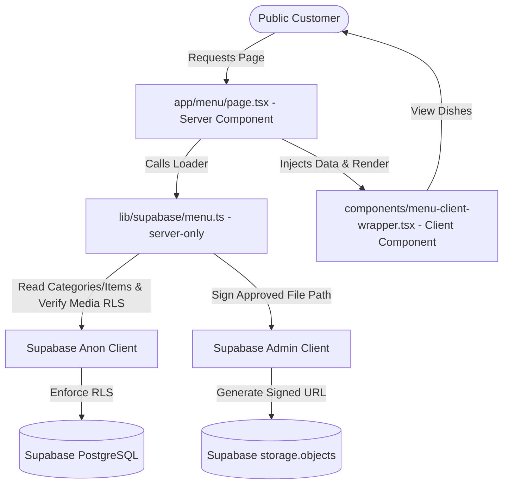

# Phase 5A: Public Menu Display Overview

This document summarizes the goals, scope, and execution details of **Phase 5A** for the **Namaste Indian Restaurant** project.

---

## 1. Project Goal

The primary goal of Phase 5A was to build the real public menu display page for customers, transitioning the menu section from a mockup preview into a fully functional, Supabase-integrated, and highly polished public catalog.

---

## 2. In-Scope vs. Out-of-Scope

### In-Scope (Phase 5A Only):
*   Real public menu route (`app/[locale]/(public)/menu/page.tsx`).
*   Premium Navy/Gold luxury visual aesthetics, including a hero banner with a price disclaimer, decorative divider, and rotating mandala motif.
*   Server-side menu data loading with strict RLS enforcement using the anonymous public client.
*   Secure storage retrieval: checked signed URLs (valid for 1 hour) with automatic page-freshness guarantee (`force-dynamic`).
*   Full search and client-side filtering on active, available, non-deleted menu items and categories.
*   Accessible category navigation via semantic `<button>` elements.
*   Fully localized SEO metadata and FoodMenu JSON-LD schema support.

### Out-of-Scope (Deferred to Phase 5B or Later):
*   No Admin Menu CMS editors.
*   No category/item creation, modification, or deletion operations.
*   No cart, checkout, or online ordering logic.
*   No reservation submission database insertion.
*   No database schema modifications.

---

## 3. Architecture & Security Boundaries

1.  **Strict Server Boundary:** The data loading logic is wrapped in `lib/supabase/menu.ts` which uses `import "server-only";`. It is impossible for this code to compile into client-side bundles.
2.  **No service-role Exposure:** The service-role key is never exposed to the client browser.
3.  **RLS Respect:** We read categories and menu items using `createClient()` from `lib/supabase/server.ts` which acts with the anonymous public role, guaranteeing that any database reads conform to RLS policies.
4.  **No Arbitrary File Signing:** The image signing helper validates the target path against active, approved public records in `media_assets` before requesting a signed URL from Storage.
